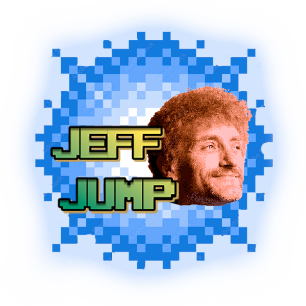
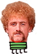

  

# JeffJump

JeffJump est un jeu inspiré du célèbre Doodle Jump, adapté au monde des fameux et légendaires Tuche. Ce jeu a été réalisé dans le contexte d'un projet étudiant du département informatique  de l'INSA Hauts-de-France.

## Auteurs

- [Nicolas PUTON · @putonnicolas](https://github.com/putonnicolas)
- [Louis POTIER · @xYzBanexYz](https://github.com/xYzBanexYz)

## Recréation du jeu sous la forme de JeffJump
Adapter Doodle Jump à l'univers des Tuche n'a pas été une tâche facile, mais le jeu est désormais jouable !

Dans le jeu, vous contrôlez un petit personnage ressemblant à Jeff Tuche :

  

Le but est de grimper le plus de plateformes possibles tout en évitant les attaques de Tuche Daddy :

  

Le score augmente à mesure que Jeff parvient à grimper des plateformes.

### Types de plateformes

Il existe trois types de plateformes :

<ul>
  <li>Frites
    

      
    

  </li>
  <li>Frites mouvantes
    

      
    

  </li>
  <li>Nevada
    

      
    

  </li>
</ul>

### Bonus

Pour avancer plus vite, certaines plateformes offrent des ressorts et des Sauces (sorte de jetpack) qui feront avancer Jeff encore plus rapidement !

  
  &nbsp;&nbsp;&nbsp;&nbsp;&nbsp;&nbsp;&nbsp;&nbsp;&nbsp;&nbsp;
  

## Licence

